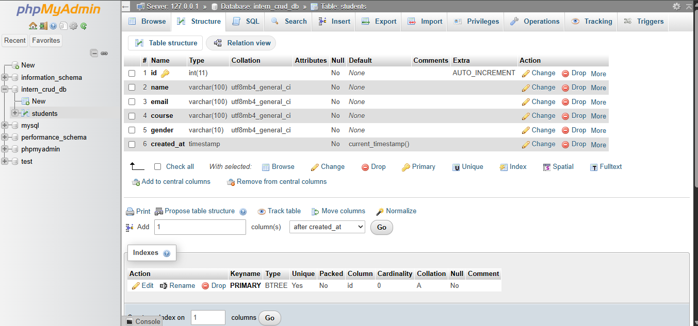
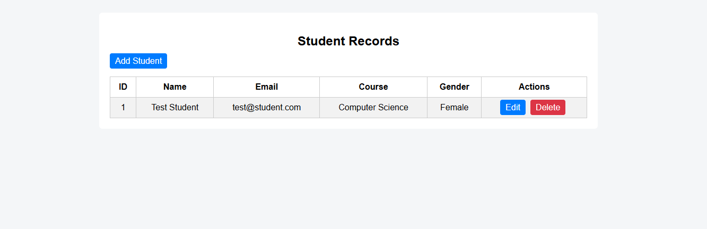
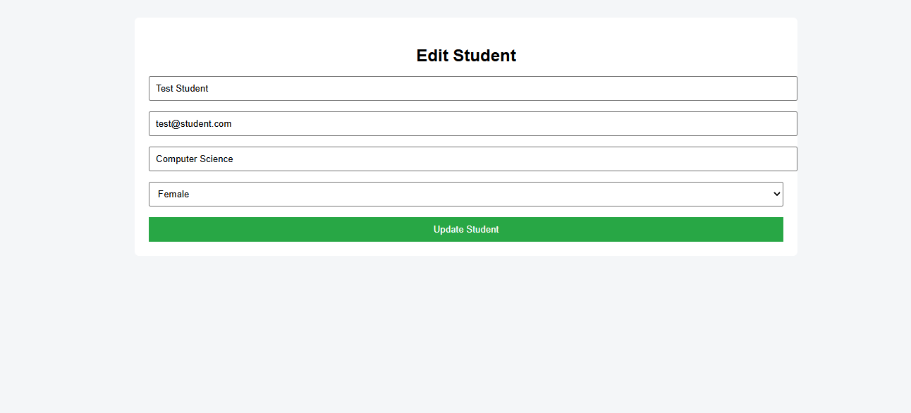

# Student Record Management System

## Project Description
This is a simple CRUD web application built with PHP and MySQL.  
It allows users to add, view, edit, and delete student records.

## Student Records Page

## Add Student Page

## Edit Student Page

## Technologies Used
- HTML
- CSS
- PHP
- MySQL
- XAMPP

## How to Run the Project

1. Install XAMPP
2. Start Apache and MySQL
3. Copy the project to the `htdocs` folder
4. Create database `intern_crud_db`
5. Import `intern_crud_db.sql`
6. Open your browser and go to:

http://localhost/student-crud/
